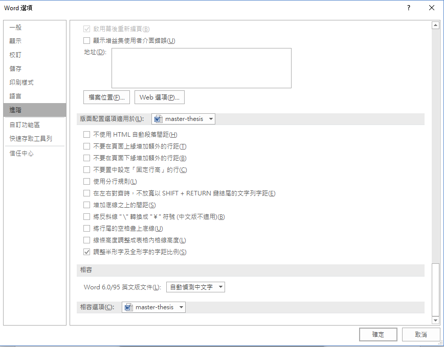
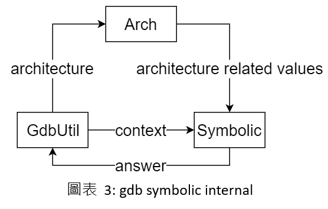
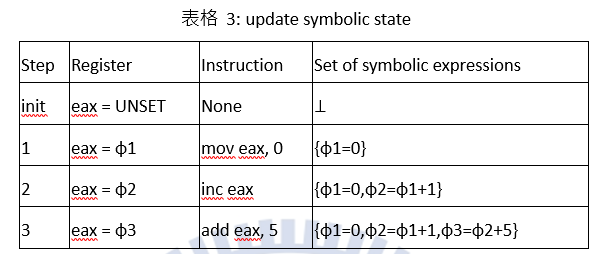
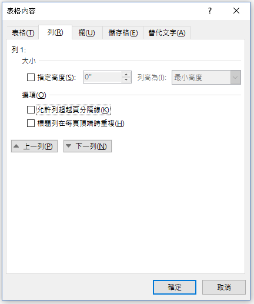

# 製作步驟

## Preface

建議先重設 word，這樣才不會衝到 word 的格式，可以參照 [重設 word 教學](https://support.microsoft.com/zh-tw/help/822005/how-to-reset-user-options-and-registry-settings-in-word)

## Steps

1. 先去[系上網站](https://www.cs.nctu.edu.tw/cswebsite/education/graduate/course)依照系所 下載 畢業相關表格下載
2. 將 `4. 網路工程研究所論文封面(表4)` 和 `6. 網路工程研究所論文書名頁(表6)` 這兩頁貼上
3. 會發覺空白字元的字距怪怪的，到 `段落`->`中文印刷格式`->`選項`->`進階` 把 `調整半形字和全形字的字距比例` 勾起來即可

4. 開始建立樣式

建議不要直接修改預設的樣式
用繼承的方式去建立一個新的，再修改比較好
比如說: `標題1` -> `自訂標題1`

5. 建立多層次清單

先建立 4 個樣式

- `自訂標題1` -> `多層次清單標題1`
- `自訂標題2` -> `多層次清單標題2`
- `自訂標題3` -> `多層次清單標題3`
- `自訂內文`

將自訂內文字體大小調成 14、與段落間間距自動、1.5 倍行距

多層次清單會綁定樣式，所以要建立新的自訂樣式出來
以下是建議的多層次清單架構

1. `多層次清單標題1`

`自訂內文`

1.1. `多層次清單標題2`

`自訂內文`

1.1.1. `多層次清單標題3`

`多層次清單標題1` 是章節標題所以要 1.5 倍行距

6. 產生目錄

再 `參考資料` 功能表依序產生三個目錄

- 目錄
- 圖表目錄
- 表格目錄

要是有更改文字記得要更新目錄

7. 新增浮水印

8. 調整邊界，頂端 2.5 公分、左側 2 公分、裝訂邊 1 公分(也可以設置為左側 3 公分、裝訂邊 0 公分)、右側 2 公分、底端 2.5 公分

9. 調整頁尾，頁面底端到頁尾 1 公分(頁尾放的是頁碼)

10. 依照不同的頁標上不同的頁碼，封面和次封面(書名頁)不要頁碼，中文摘要、英文摘要、致謝、目錄、圖表目錄(羅馬數字)，本文開始(數字)，這邊可以使用分節和分頁達成

# 字型設定

英文為 `Times New Roman`，中文為 `DFKai-SB(標楷體)`
除了從系上複製過來的論文封面和論文書名頁
兩頁的字體維持不變以外
其他字體都以這兩種為主
內文的文字對齊方式為 `左右對齊`

# 幫圖片或表格標示文字

插入圖片或表格後，到 `參考資料` -> `插入標號` 插入文字

之後用 `參考資料` -> `交互參照` 就可以在文中引用

**注意圖片通常是文字在圖片下面，表格是文字在上**

**記得更新圖表目錄**

 

# 畫圖

要畫圖的話可以用 [draw.io](https://www.draw.io/) 畫

# 疑難雜症解法

## 表格會跨頁

到 `表格工具` -> `版面配置` -> `內容` -> `列` -> 把 `允許列超越頁分隔線` 取消勾選

## 中英文夾雜導致左右對齊有問題

因為預設英文字不會被截斷，過長的英文字會導致整行變的怪怪的，這時候只能自行將英文字斷字
選取要斷字的英文字，然後到 `版面配置` -> `版面設定` -> `斷字` -> `手動` 把過長的英文字斷字
